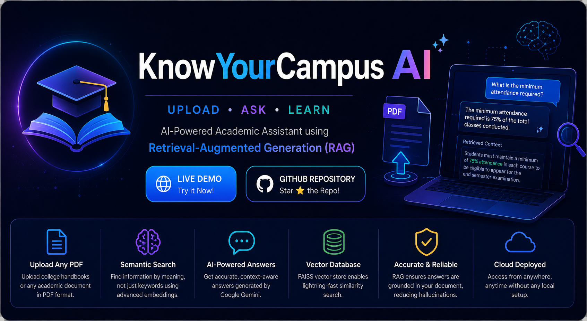
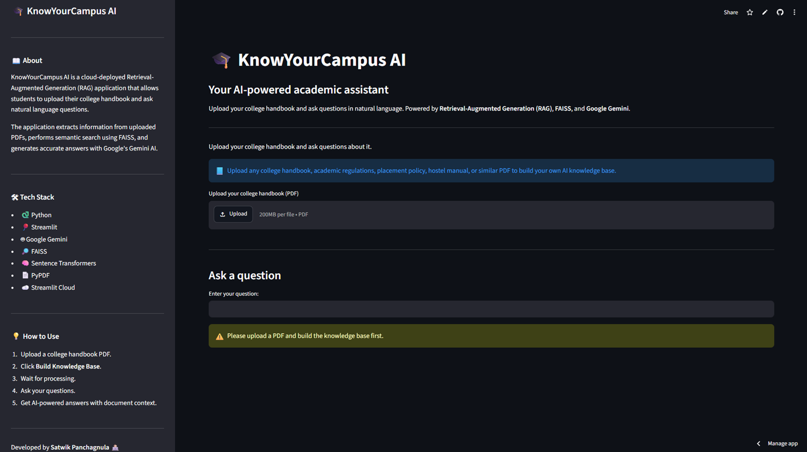
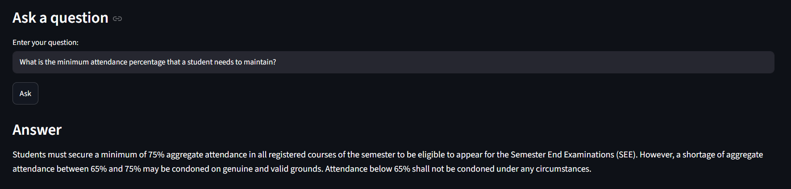
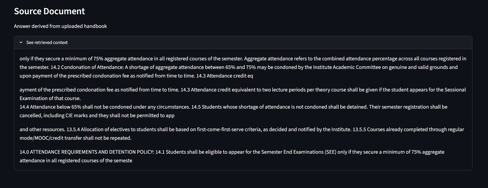
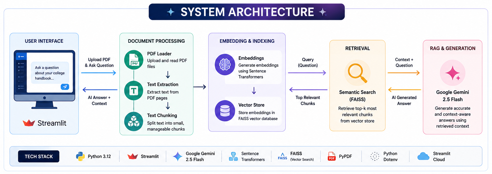
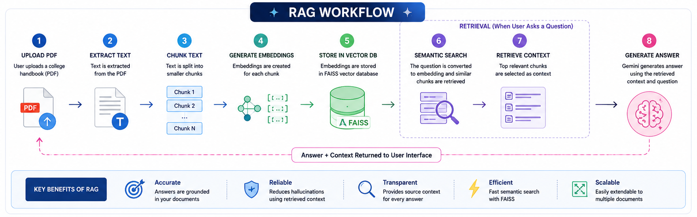
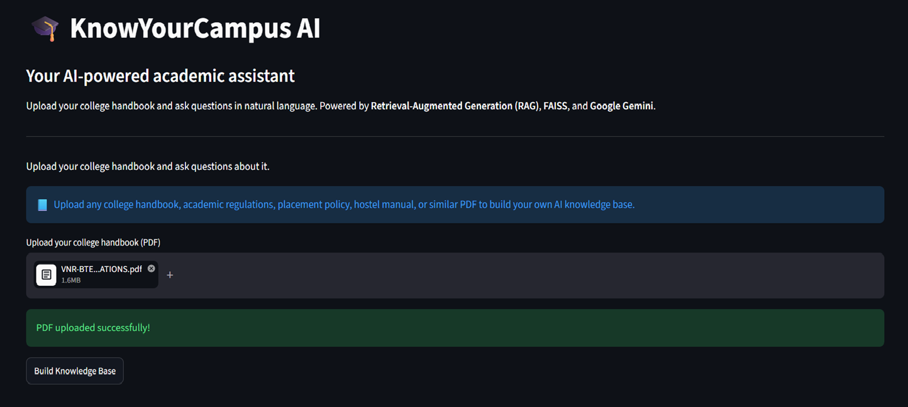

<p align="center">



</p>
# 🎓 KnowYourCampus AI

### **An AI-powered Academic Assistant built using Retrieval-Augmented Generation (RAG)**

Transform static college handbooks into an intelligent AI assistant capable of answering academic questions in natural language.

## 🎯 Problem Statement

College handbooks contain valuable academic information but are often lengthy and difficult to navigate. Students spend significant time manually searching through hundreds of pages to find simple answers.

KnowYourCampus AI solves this problem by converting static PDF handbooks into an intelligent conversational assistant using Retrieval-Augmented Generation (RAG), enabling instant, context-aware question answering.

<p align="center">

<a href="https://knowyourcampus-ai.streamlit.app/">

</a>

<a href="https://github.com/panchagnula-satwik/KnowYourCampus-AI">

</a>

</p>

<p align="center">


</p>

---

# 📖 Project Overview

Finding information inside lengthy academic handbooks can be frustrating. Students often spend valuable time searching through hundreds of pages to locate attendance rules, grading policies, examination regulations, placement guidelines, hostel rules, and other important information.

**KnowYourCampus AI** eliminates this problem by converting any college handbook into an intelligent AI-powered assistant.

The application combines **Retrieval-Augmented Generation (RAG)** with **semantic search** to understand the contents of uploaded PDF documents and answer user questions using only the relevant information from those documents.

Unlike traditional keyword search, the system understands the **meaning** behind a question, retrieves the most relevant sections using vector embeddings, and generates context-aware responses with **Google Gemini**.

The application is fully cloud-deployed using **Streamlit Community Cloud**, allowing users to upload any college handbook directly from their browser without installing additional software.

---

# ✨ Key Highlights

✅ Upload any college handbook or academic regulation PDF

✅ Automatically build a searchable AI knowledge base

✅ Semantic document search using FAISS vector indexing

✅ Context-aware question answering using Google Gemini

✅ Dynamic document processing (works with different colleges)

✅ Fully browser-based deployment using Streamlit Cloud

✅ Clean, responsive, and interactive web interface

---

> **"Upload once. Ask anything. Learn instantly."**

---

# 📸 Application Preview

## 🏠 Home Page



---

## 💬 AI-Powered Question Answering



---

## 📖 Retrieved Context



---

# 🚀 Features

<table>
<tr>
<td width="50%">

### 📄 Dynamic PDF Upload

Upload any college handbook or academic regulation document directly through the web interface.

</td>

<td width="50%">

### 🧠 Semantic Search

Retrieves relevant information based on meaning rather than exact keyword matching using vector embeddings.

</td>
</tr>

<tr>
<td>

### 🤖 AI-Powered Responses

Google Gemini generates context-aware answers grounded in the uploaded handbook.

</td>

<td>

### ⚡ Instant Knowledge Base

Automatically extracts text, chunks documents, creates embeddings, and builds a searchable FAISS vector database.

</td>
</tr>

<tr>
<td>

### ☁️ Cloud Deployment

Accessible directly from any browser using Streamlit Community Cloud.

</td>

<td>

### 📚 Source Transparency

Displays the retrieved document context used to generate every response.

</td>
</tr>
</table>

---

# 🏗 System Architecture




# 🔄 RAG Workflow



---

# 🧠 How Retrieval-Augmented Generation (RAG) Works

Traditional Large Language Models answer questions using only their pre-trained knowledge. This often leads to hallucinations or outdated responses when asked about custom documents.

KnowYourCampus AI overcomes this limitation through **Retrieval-Augmented Generation (RAG)**.

Instead of sending the entire PDF directly to the language model, the application first retrieves the most relevant sections of the uploaded handbook using semantic similarity search.

Only those highly relevant document chunks are passed to **Google Gemini**, ensuring that every response is grounded in the uploaded document rather than relying on the model's general knowledge.

This approach provides:

- ✅ Higher answer accuracy
- ✅ Reduced hallucinations
- ✅ Faster response generation
- ✅ Document-specific reasoning
- ✅ Reliable academic information retrieval

---

# ⚙ AI Pipeline

| Stage | Technology |
|--------|------------|
| PDF Processing | PyPDF |
| Text Chunking | Python |
| Embedding Generation | Sentence Transformers |
| Vector Database | FAISS |
| Semantic Retrieval | Cosine Similarity Search |
| Language Model | Google Gemini 2.5 Flash |
| User Interface | Streamlit |
| Deployment | Streamlit Community Cloud |

---
# 🛠️ Technology Stack

<table>
<tr>
<td align="center" width="180">

### 🐍 Programming

Python 3.12

</td>

<td align="center" width="180">

### 🎈 Frontend

Streamlit

</td>

<td align="center" width="180">

### 🤖 AI Model

Google Gemini 2.5 Flash

</td>

<td align="center" width="180">

### 🧠 Embeddings

Sentence Transformers

</td>
</tr>

<tr>
<td align="center">

### 🔍 Vector Search

FAISS

</td>

<td align="center">

### 📄 PDF Processing

PyPDF

</td>

<td align="center">

### 📦 Environment

Python Dotenv

</td>

<td align="center">

### ☁️ Deployment

Streamlit Community Cloud

</td>
</tr>
</table>

---

# 📂 Project Structure

```text
KnowYourCampus-AI
│
├── app
│   └── app.py                 # Streamlit application
│
├── config
│   └── config.yaml            # Configuration file
│
├── data
│   ├── raw_pdfs               # Uploaded PDFs
│   └── processed              # Generated text & chunks
│
├── src
│   ├── ingest.py              # PDF text extraction
│   ├── chunking.py            # Document chunk creation
│   ├── embeddings.py          # Embedding generation
│   ├── retriever.py           # FAISS semantic search
│   ├── rag_pipeline.py        # Gemini integration
│   └── utils.py               # Helper functions
│
├── assets                     # README screenshots
│
├── .streamlit
│   └── config.toml
│
├── requirements.txt
├── .env.example
└── README.md
```

---

# ⚙️ Installation Guide

## 1️⃣ Clone the Repository

```bash
git clone https://github.com/panchagnula-satwik/KnowYourCampus-AI.git

cd KnowYourCampus-AI
```

---

## 2️⃣ Create a Virtual Environment

### Windows

```bash
python -m venv .venv

.venv\Scripts\activate
```

### macOS / Linux

```bash
python3 -m venv .venv

source .venv/bin/activate
```

---

## 3️⃣ Install Dependencies

```bash
pip install -r requirements.txt
```

---

## 4️⃣ Configure Environment Variables

Create a `.env` file in the project root.

```env
GEMINI_API_KEY=YOUR_GEMINI_API_KEY
```

> 💡 You can generate a free API key from **Google AI Studio**.

---

## 5️⃣ Launch the Application

```bash
streamlit run app/app.py
```

The application will automatically open in your browser.

---

# 🌐 Live Demo

Try the deployed application here:

### 🚀 https://knowyourcampus-ai.streamlit.app

---

# 📖 How to Use

### Step 1

Upload any college handbook in PDF format.

↓

### Step 2

Click **Build Knowledge Base**.

↓

### Step 3

Wait while the application:

- extracts text
- creates chunks
- generates embeddings
- builds the FAISS index

↓

### Step 4

Ask questions in natural language.

↓

### Step 5

Receive AI-generated answers with the retrieved document context.

---

# 🔐 Environment Variables

| Variable | Description |
|-----------|-------------|
| `GEMINI_API_KEY` | Google Gemini API Key |

---

# 💻 Supported Platforms

✅ Windows

✅ Linux

✅ macOS

✅ Streamlit Cloud

---

# 📌 Requirements

- Python 3.12+
- Internet connection
- Gemini API Key

---
# 🎥 Live Demonstration

Experience the application live without any local installation.

<p align="center">

<a href="https://knowyourcampus.streamlit.app">

</a>

</p>

---

# 📸 More Application Screens

## 📤 Upload a College Handbook



---

## 🤖 AI Response Generation

The application retrieves only the most relevant document sections before generating an answer.


---

## 📚 Retrieved Context

Every answer is backed by the retrieved context, making responses transparent and trustworthy.


---

# 🌟 Why KnowYourCampus AI?

Most students spend valuable time searching through lengthy PDF handbooks for attendance rules, grading systems, examination policies, placement information, hostel regulations, and other academic details.

KnowYourCampus AI transforms these static documents into an intelligent assistant capable of understanding natural language questions and providing instant, context-aware answers.

Instead of manually scrolling through hundreds of pages, students can simply ask:

> "What is the minimum attendance required?"

or

> "How many credits are required for graduation?"

and receive accurate answers within seconds.

---

# 🚀 Future Enhancements

This project has been designed with extensibility in mind.

Planned improvements include:

- 💬 Chat history with conversational memory
- 📄 Support for multiple PDF documents
- 📚 Source page references
- 🖼 OCR support for scanned PDFs
- 🎙 Voice-based question answering
- 🌐 Multi-language support
- 🧠 Local LLM integration using Ollama
- 🔍 Hybrid Search (Semantic + Keyword)
- 📊 Analytics dashboard for document insights
- 👥 Multi-user authentication

---

# 🎯 Learning Outcomes

Through this project, I gained practical experience in:

- Retrieval-Augmented Generation (RAG)
- Large Language Model Integration
- Semantic Search
- Vector Databases
- Prompt Engineering
- Cloud Deployment
- Streamlit Application Development
- Document Intelligence
- GitHub Version Control
- End-to-End AI Application Development

---

# 📄 License

This project is intended for educational and portfolio purposes.

Feel free to explore, learn from, and build upon it.

---

<p align="center">

### 🎓 KnowYourCampus AI

### Upload • Ask • Learn

Built with ❤️ by **Satwik Panchagnula**

</p>

---

# 🎯 Real-World Applications

KnowYourCampus AI can be adapted beyond college handbooks to support a wide range of document-based AI assistants.

### 🎓 Education
- College Academic Regulations
- Course Handbooks
- Placement Guidelines
- Hostel Manuals
- Examination Policies

### 🏢 Enterprise
- Company SOPs
- Employee Handbooks
- HR Policy Documents
- Internal Knowledge Bases

### ⚖ Legal
- Contracts
- Compliance Documents
- Government Notifications

### 🏥 Healthcare
- Hospital Guidelines
- Medical Protocols
- Patient Information Documents

### 📚 Research
- Research Papers
- Technical Documentation
- User Manuals

---

# 💡 Challenges Solved

Traditional PDF documents present several usability challenges.

❌ Time-consuming manual searching

❌ Keyword-based search limitations

❌ Large documents are difficult to navigate

❌ Information scattered across hundreds of pages

KnowYourCampus AI addresses these challenges through semantic search and Retrieval-Augmented Generation, enabling users to interact with documents conversationally.

---

# 📈 Project Highlights

| Feature | Status |
|----------|--------|
| Dynamic PDF Upload | ✅ |
| Text Extraction | ✅ |
| Intelligent Chunking | ✅ |
| Semantic Embeddings | ✅ |
| FAISS Vector Search | ✅ |
| Google Gemini Integration | ✅ |
| RAG Pipeline | ✅ |
| Cloud Deployment | ✅ |
| Browser-based UI | ✅ |
| Source Context Display | ✅ |

---

# 📊 Skills Demonstrated

This project demonstrates practical experience in:

- Artificial Intelligence
- Retrieval-Augmented Generation (RAG)
- Prompt Engineering
- Natural Language Processing
- Semantic Search
- Vector Databases
- Streamlit Development
- Cloud Deployment
- Software Engineering
- API Integration
- Git & GitHub
- Python Programming

---

# 🚀 Future Roadmap

The following improvements are planned for future versions.

### Version 2.0

- 💬 Chat History
- 📄 Multi-document Knowledge Base
- 📖 Page Number Citations
- 📊 Knowledge Base Analytics
- 🧠 Conversation Memory

### Version 3.0

- 🎙 Voice Assistant
- 🌐 Multi-language Support
- 🤖 Local LLM Support (Ollama)
- 🔍 Hybrid Search (Keyword + Semantic)
- 👥 User Authentication

---

# 👨‍💻 About the Developer

## Satwik Panchagnula

**B.Tech – Computer Science & Engineering (Artificial Intelligence & Machine Learning)**

Malla Reddy College of Engineering & Technology

I'm passionate about building practical AI applications that solve real-world problems using Machine Learning, Large Language Models, Retrieval-Augmented Generation, and Natural Language Processing.

This project reflects my interest in developing intelligent software that makes information more accessible through AI.

---

## 📬 Connect With Me

<p align="left">

<a href="https://www.linkedin.com/in/satwik-panchagnula">

</a>

<a href="https://github.com/panchagnula-satwik">

</a>

</p>

---

# ⭐ Support the Project

If you enjoyed this project,

⭐ Star the repository

🍴 Fork it

💬 Share your feedback

Your support helps improve future AI projects.

---

<p align="center">

# 🎓 KnowYourCampus AI

### Upload • Ask • Learn

Built with ❤️ using Python, FAISS, Streamlit & Google Gemini

</p>